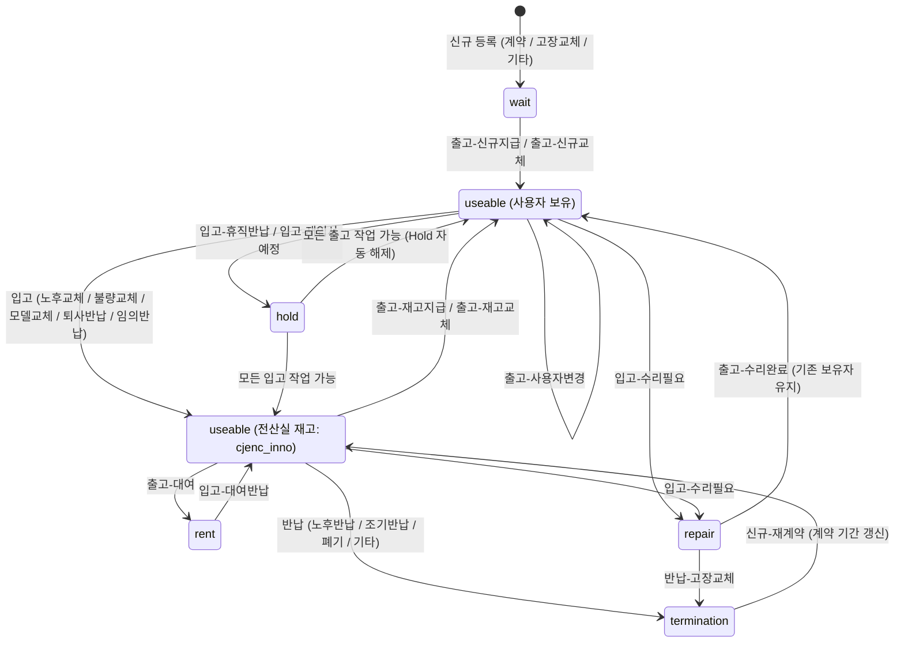

# 자산 거래 유형 및 상태 전이 가이드 (Transaction Guide)

본 문서는 AssetDB 시스템에서 지원하는 **자산 거래(Trade) 작업 유형(`work_type`)**과 자산 상태(`state`), 소유자(`in_user`)의 **상태 전이 패스(State Transition Path)** 및 비즈니스 규칙을 단일 문서로 정의합니다.

---

## 1. 기본 개념 정의

### 1.1 자산 상태 (`assets.state`)
| 상태 코드 | 상태명 | 설명 |
|---|---|---|
| `wait` | 신규 대기 | 신규 자산 등록 후 사용자에게 지급되기 전 초기 상태 |
| `useable` | 사용 가능 / 사용 중 | 전산실 재고로 대기 중이거나 사원이 정상 사용 중인 상태 |
| `rent` | 대여 중 | 임시/단기 목적으로 사용자에게 대여된 상태 |
| `repair` | 수리 중 | 고장/수리를 위해 입고/발송 처리된 상태 |
| `hold` | 보관 / 보류 | 휴직, 재입사 예정 등의 사유로 소유권을 유지한 채 전산실에 보관 중인 상태 |
| `termination` | 계약 종료 / 반납 완료 | 렌탈사 반납 또는 폐기 처리 완료된 종료 상태 |

### 1.2 소유자 / 관리 주체 (`assets.in_user`)
| 식별자 | 명칭 | 설명 |
|---|---|---|
| `cjenc_inno` | 전산실 재고 | 회사 전산실에 입고되어 관리 중인 자산 |
| `aj_rent` | 반납처 / 렌탈사 | 렌탈 계약 만료/해지 등으로 반납 완료된 자산 |
| `사원 ID (cj_id)` | 사용자 보유 | 특정 임직원에게 지급/대여되어 사용 중인 자산 |

---

## 2. 상태 전이 다이어그램 (Lifecycle Flow)

---

## 3. 거래 유형별 상세 패스 명세

### 3.1 신규 (New)
| 작업 유형 (`work_type`) | 시작 조건 (`state`) | 처리 후 상태 | 처리 후 소유자 (`in_user`) | 주요 비즈니스 규칙 및 입력값 |
|---|---|---|---|---|
| **신규-계약** | 신규 등록 | `wait` | 미지정 (`null`) | 신규 구매/렌탈 계약 자산 등록 |
| **신규-고장교체** | 신규 등록 | `wait` | 미지정 (`null`) | 고장 자산 교체용 신규 등록 |
| **신규-기타** | 신규 등록 | `wait` | 미지정 (`null`) | 기타 사유 신규 등록 |
| **신규-재계약** | `termination` | `useable` | `cjenc_inno` | 계약 만료 자산 재계약 입고 - 신규 시작일(`day_of_start`), 종료일(`day_of_end`) 필수 입력 |

### 3.2 출고 (Outbound)
| 작업 유형 (`work_type`) | 시작 조건 (`state` / 소유자) | 처리 후 상태 | 처리 후 소유자 (`in_user`) | 주요 비즈니스 규칙 및 입력값 |
|---|---|---|---|---|
| **출고-신규지급** | `wait` | `useable` | 지정 사용자 (`cj_id`) | 신규 입고 자산 최초 사용자 지급 |
| **출고-신규교체** | `wait` | `useable` | 지정 사용자 (`cj_id`) | 교체 요청 사용자에게 신규 자산 출고 |
| **출고-재고지급** | `useable` & 전산실 재고 (`cjenc_inno`) | `useable` | 지정 사용자 (`cj_id`) | 전산실 보유 재고를 사용자에게 지급 |
| **출고-재고교체** | `useable` & 전산실 재고 (`cjenc_inno`) | `useable` | 지정 사용자 (`cj_id`) | 교체 대상자에게 전산실 재고 출고 |
| **출고-대여** | `useable` & 전산실 재고 (`cjenc_inno`) | `rent` | 지정 사용자 (`cj_id`) | 전산실 재고를 임시 대여 출고 |
| **출고-사용자변경** | `useable` & 사용자 보유 | `useable` | 변경 대상 사용자 (`cj_id`) | 기존 사용자와 다른 사용자 선택 필수 |
| **출고-수리완료** | `repair` | `useable` | 기존 소유자 유지 | 수리 완료 후 기존 보유자에게 복귀 (소유자 변경 없음) |

### 3.3 입고 (Inbound)
| 작업 유형 (`work_type`) | 시작 조건 (`state` / 소유자) | 처리 후 상태 | 처리 후 소유자 (`in_user`) | 주요 비즈니스 규칙 및 입력값 |
|---|---|---|---|---|
| **입고-노후교체** | `useable` & 사용자 보유 | `useable` | `cjenc_inno` | 노후 교체에 따른 기존 자산 전산실 입고 |
| **입고-불량교체** | `useable` & 사용자 보유 | `useable` | `cjenc_inno` | 불량 교체에 따른 기존 자산 전산실 입고 |
| **입고-모델교체** | `useable` & 사용자 보유 | `useable` | `cjenc_inno` | 모델 변경에 따른 기존 자산 전산실 입고 |
| **입고-퇴사반납** | `useable` & 사용자 보유 | `useable` | `cjenc_inno` | 퇴사자 반납 자산 전산실 입고 |
| **입고-임의반납** | `useable` & 사용자 보유 | `useable` | `cjenc_inno` | 사용자 임의 반납 자산 전산실 입고 |
| **입고-대여반납** | `rent` | `useable` | `cjenc_inno` | 대여 중인 자산 반납 입고 |
| **입고-수리필요** | `useable` | `repair` | 기존 소유자 유지 | 수리 접수/발송 (소유자 변경 없음) |
| **입고-휴직반납** | `useable` & 사용자 보유 | `hold` | 기존 소유자 유지 | 휴직자 자산 임시 보관 (소유권 유지) |
| **입고-재입사예정** | `useable` & 사용자 보유 | `hold` | 기존 소유자 유지 | 재입사 예정자 자산 임시 보관 (소유권 유지) |

### 3.4 반납 (Return - 렌탈사/폐기)
| 작업 유형 (`work_type`) | 시작 조건 (`state` / 소유자) | 처리 후 상태 | 처리 후 소유자 (`in_user`) | 주요 비즈니스 규칙 및 입력값 |
|---|---|---|---|---|
| **반납-노후반납** | `useable` & 전산실 재고 (`cjenc_inno`) | `termination` | `aj_rent` | 계약 만료 노후 자산 렌탈사 반납 |
| **반납-고장교체** | `useable` 또는 `repair` & 전산실 재고 | `termination` | `aj_rent` | 고장 자산 렌탈사 맞교환 반납 (교체 자산 연계) |
| **반납-조기반납** | `useable` & 전산실 재고 (`cjenc_inno`) | `termination` | `aj_rent` | 계약 중도 해지 자산 반납 |
| **반납-폐기** | `useable` & 전산실 재고 (`cjenc_inno`) | `termination` | `aj_rent` | 노후/파손 자산 폐기 처리 |
| **반납-기타** | `useable` & 전산실 재고 (`cjenc_inno`) | `termination` | `aj_rent` | 기타 사유 렌탈사 반납 |

---

## 4. 특수 비즈니스 로직 및 롤백 정책

1. **`hold` 상태 처리 정책**:
   - `hold` 상태의 자산은 상태 제약 검사를 통과하여 모든 작업 유형(출고, 입고, 반납 등)을 바로 수행할 수 있습니다.
2. **소유자 자동 할당 (Fixed User)**:
   - 일반 입고 건은 거래 대상자 ID가 자동으로 `cjenc_inno`(전산실)로 세팅됩니다.
   - 렌탈사 반납 건은 거래 대상자 ID가 자동으로 `aj_rent`(반납처)로 세팅됩니다.
3. **거래 취소 및 자산 상태 복구 (Rollback)**:
   - 등록된 거래 삭제 시, `trade` 테이블에 백업 기록된 직전 자산 상태(`asset_state`), 직전 소유자(`asset_in_user` 또는 `ex_user`), 메모(`asset_memo`)를 기반으로 자산 정보를 원래 상태로 복원합니다.

---

## 5. 관련 소스 코드 참조

* **프론트엔드 유효성 검증 및 작업 정의**: [`src/constants/workTypes.js`](file:///d:/CODE/assetDB_git/src/constants/workTypes.js)
* **백엔드 트랜잭션 및 상태 전이 서비스**: [`backend/services/TradeService.js`](file:///d:/CODE/assetDB_git/backend/services/TradeService.js)
* **데이터베이스 스키마 정의**: [`DB_SCHEMA.sql`](file:///d:/CODE/assetDB_git/DB_SCHEMA.sql)
